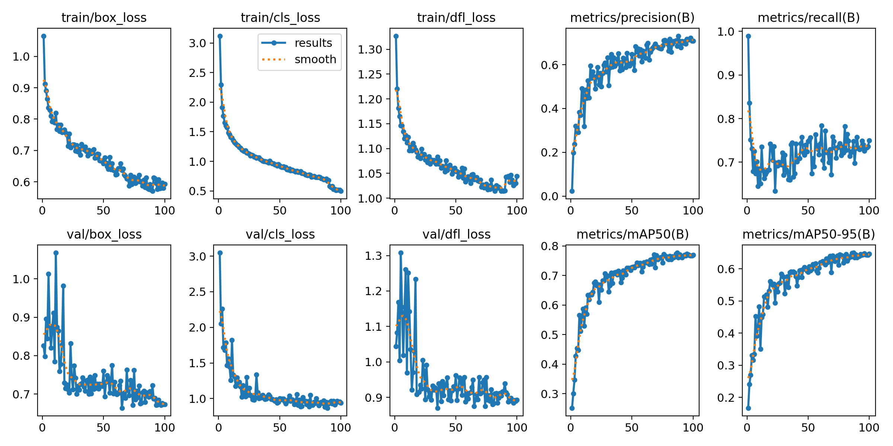
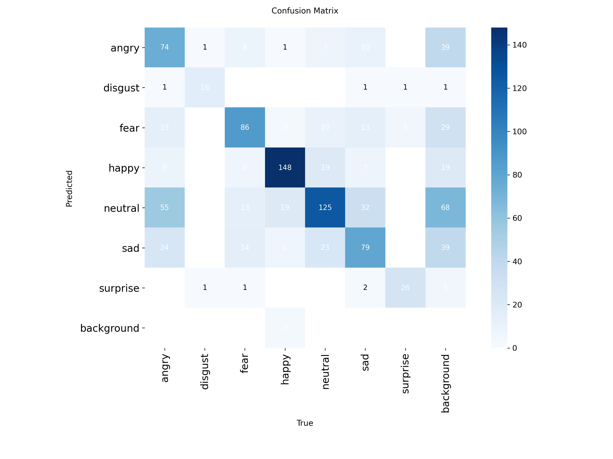

# MoodLens - A Streaming Framework for Facial Sentimental Analysis

MoodLens is a Python project for real-time facial emotion recognition using YOLOv11 object detection and a custom Roboflow dataset. It features automated SOS alert system via Twilio when at-risk emotions are detected.

## Features
- YOLO-based facial emotion detection
- Custom dataset integration via Roboflow
- SOS alerts using Twilio API
- Visualization of predictions and confusion matrix

## Sample Results

